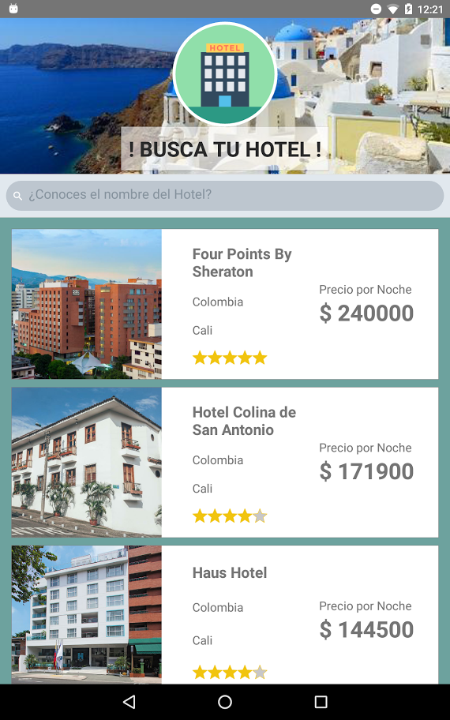
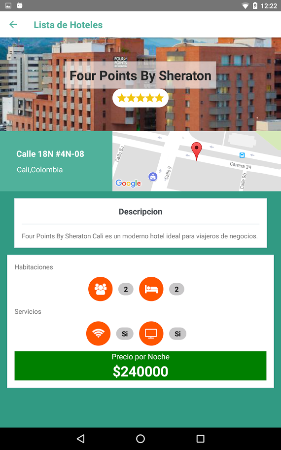

Bienvenido
===================


Bienvenid@s,  Proyecto **FullStackMobile** presentado por Sebastian Otalora (@jhonsebas77)

----------

API Rest
-------------
> **API Endpoints: (/api/)**

> - GET /hotels
> - GET /hotels/:id
> - POST /hotels/
> - PUT /hotels/:id
> - DELETE /hotels/:id

Para implementar el API se desarrollo un servidor web el cual responde a las peticiones que le realizaremos, ademas se utiliza Node..js y el servicio de MongoLab como base de datos, como framework para Node se utilizo *Express* y se utilizo *Mongoose*  para conectarse a Mongo y poder mapear los modelos de la base de datos

**Ejecutar el API**

Para ejecutar el api se debe configurar la variable **url** dentro de API.js con el puerto la maquina en donde se ejecutará el servidor web en la ruta <kbd>./FullStackMobile/utilities/API.js
</kbd>

```
<!-- API.js --> 

const url='http://192.168.10.148:3000/api/hotels/';

```
Una vez configurado nuestro servidor podemos ejecutar <kbd>node server.js
</kbd>  estando en la carpeta del proyecto, una vez en consola nos retorne *Node server running on http://localhost:3000* el servicio esta activo y se podran realizar peticiones al servidor por medio de la direccion <kbd>http://localhost:3000/api/hotels/</kbd> utilizando los métodos estandar GET, PUSH, POST, DELETE


Aplicación Móvil
-------------
**Configurando el entorno de ejecución**

Una vez instalado React Native, configuremos lo básico para cargar el proyecto

> **Nota:**

> - Necesitamos un editor de texto, ya sea *Sublime Text2* o en nuestro caso *Atom*
> - Tambien necesitamos un cliente de *Git Hub*, en nuestro caso usaremos *Git Hub Desktop* para tener control de versiones


 2. Clonar el proyecto con el App de GitHub Desktop
 3. En la terminal ubicarse en la carpeta donde se ejecutara el proyecto
 <kbd> cd /FullStackMobile </kbd>
 4. Crear el proyecto con el mismo nombre del proyecto de GitHub, darle (yes) al momento de reemplazar el fichero <kbd> react-native init nombre_proyecto </kbd>
 5. Realizar el *commit* y luego el *fetch* en la aplicación de GitHub Desktop
 6. Abrir la carpeta del proyecto utilizando el editor de texto deseado para comenzar a editarlo
 7. Conectar nuestro dispositivo Android con la opción de **Desarrollador** activada junto a la opción **Depuración USB**
 8. Nos ubicamos dentro de la carpeta del proyecto en dos distintas terminales  <kbd>cd /nombre_proyecto </kbd>
 9. Instalamos las dependencias necesarias por medio de <kbd>npm dependencia --save</kbd>
 10. Y ejecutamos <kbd>react-native start </kbd> en la primera ventana, una vez indique *Loading dependency graph, done.*  ejecutamos en la segunda ventana <kbd>react-native run-android</kbd>

> **Dependencias Utilizadas:** Estas son las dependencias utilizadas en el proyecto
<kbd>express </kbd>
<kbd>react-navigation</kbd>
<kbd>react-native-elements</kbd>
<kbd>react-native-vector-icons </kbd>
<kbd>react-native link react-native-vector-icons</kbd>
<kbd>mongoose</kbd>
<kbd>react-native-maps </kbd>

**¿Hotel?**


El App está compuesta de la siguiente forma
>  <kbd>Componentes ./FullStackMobile/src/components/</kbd>

> - ./components/Banner : *Header Bienvenida*
> - ./components/DescHotel :*Descripción Hotel Específico*
> - ./components/HeaderDetail : *Header Hotel Específico*
> - ./components/InfoHotel : *Detalles Hotel Específico*
> - ./components/ImageOverlay : *Componente Texto sobre Imagen*
> - ./components/ItemHotel : *Cada uno de los Hoteles que retorna GET/*
> - ./components/Loading : *Loading Screen*


----------
>  <kbd>VIstas ./FullStackMobile/src/pages/</kbd>

> - ./pages/MainScreen  : *Vista de inicio, visualiza GET/*
> - ./pages/Hotel            :*Vista Hotel Específico*

----------
>  <kbd>Otros </kbd>

> - ./server  : *Servidor WEB*
> - ./models/hotels  : *Modelos para la BD*
> - ./src/img/  : *Recursos Graficos*
> - ./controllers/Ctrlhotels  : *Controladores para la BD*
> - ./util/API  : *API*


----------

## Capturas Pantalla
#### Pantalla de Inicio


> - Vista compuesta por un Header con el icono del App, una barra de búsqueda que permite encontrar un hotel en específico y un <kbd>FlatList</kbd> que renderiza la respuesta obtenida de nuestra API

----------

#### Vista Detalle

> - Vista donde se visualiza la información obtenida de nuestra API al realizar la peticion GET/:id compuesta por un Header con el nombre del Hotel seleccionado y su calificación, información de la ubicación del hotel, una tarjeta con una breve descripción. y por último una tarjeta en la que se visualizan los diferentes servicios que ofrece el hotel junto al tipo de habitaciones, también se visualiza el costo de una noche en la habitacion de ese hotel

----------

#### Video Preview
https://youtu.be/7X7ZxgpxRKM